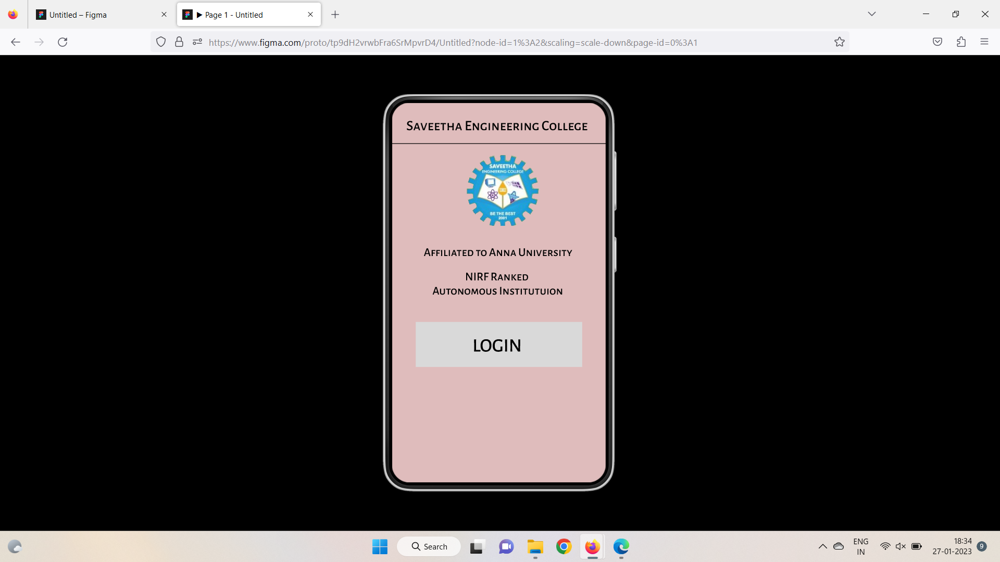
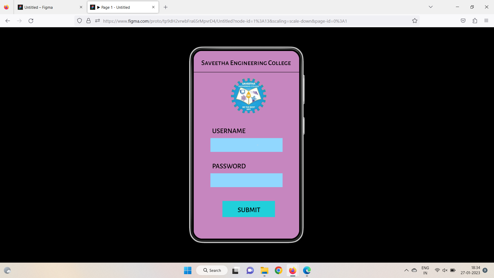
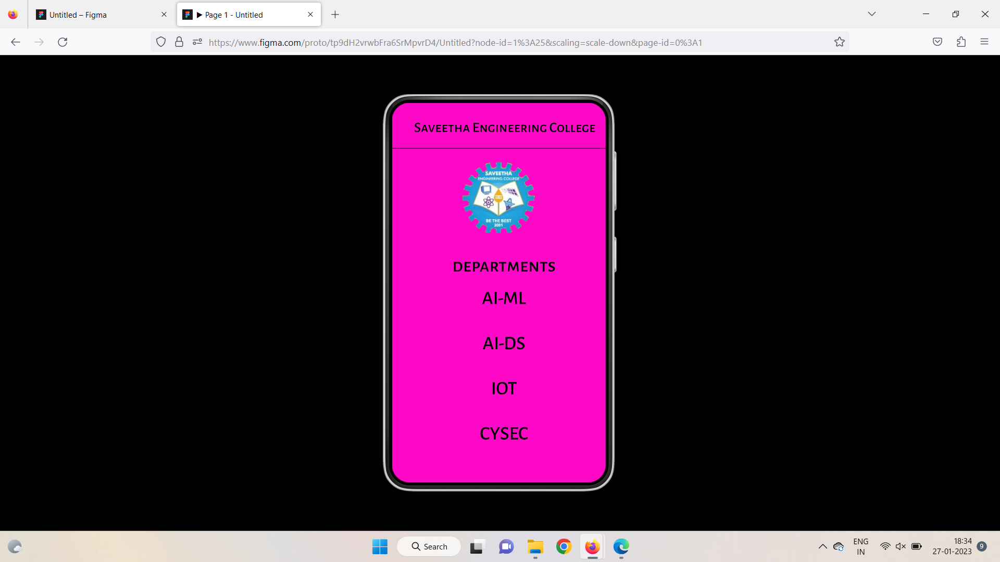

# Event Registration Web Application

## AIM:
To design, develop and deploy a web application for event registration.

## DESIGN STEPS:

### Step 1:
Create a new frame.

### Step 2:
Select any one preset size of your choice.

### Step 3:
Select the shapes you need.

### Step 4:
Import images as needed.

### Step 5:
Create pages based on your need and link them.

### Step 6:

Validate the HTML and CSS code.

### Step 6:

Publish the website in the given URL.

## DESIGN TOOL:
Figma

## Code:

```
/*Home Page */
/* Line 1 */

position: absolute;
width: 360px;
height: 0px;
left: 0px;
top: 69px;
border: 1px solid #000000;
/*Whatsapp Image 2023-01-27 at 17.39 1 */
position: absolute;
width: 131px;
height: 119px;
left: 121px;
top: 88px;
background: url(WhatsApp Image 2023-01-27 at 17.39.png);
/* Affiliated to Anna University */
position: absolute;
width: 323px;
height: 32px;
left: 17px;
top: 240px;
font-family: 'Alegreya Sans SC';
font-style: normal;
font-weight: 500;
font-size: 20px;
line-height: 24px;
text-align: center;
color: #000000;
/* NIRF Ranked Autonomous Institutuion */

position: absolute;
width: 324px;
height: 57px;
left: 16px;
top: 281px;
font-family: 'Alegreya Sans SC';
font-style: normal;
font-weight: 500;
font-size: 20px;
line-height: 24px;
text-align: center;
color: #000000;
/* Rectangle 1 */
position: absolute;
width: 280px;
height: 76px;
left: 40px;
top: 369px;
background: #D9D9D9;
/* LOGIN */
position: absolute;
width: 244px;
height: 41px;
left: 55px;
top: 390px;
font-family: 'Alegreya Sans SC';
font-style: normal;
font-weight: 500;
font-size: 32px;
line-height: 38px;
text-align: center;
color: #000000;
/* Saveetha Engineering College */
position: absolute;
width: 323px;
height: 27px;
left: 24px;
top: 24px;
font-family: 'Alegreya Sans SC';
font-style: normal;
font-weight: 500;
font-size: 24px;
line-height: 29px;
color: #000000;

/*Login Page*/
/* Line 2 */
position: absolute;
width: 360px;
height: 0px;
left: 0px;
top: 73px;
border: 1px solid #000000;
/* WhatsApp Image 2023-01-27 at 17.39 2 */
position: absolute;
width: 131px;
height: 119px;
left: 122px;
top: 93px;
background: url(WhatsApp Image 2023-01-27 at 17.39.png);
/* Rectangle 2 */
position: absolute;
width: 246px;
height: 47px;
left: 57px;
top: 297px;
background: #91D7FE;
/* Rectangle 3 */
position: absolute;
width: 246px;
height: 47px;
left: 57px;
top: 417px;
background: #91D7FE;
/* Rectangle 4 */
position: absolute;
width: 4px;
height: 1px;
left: 216px;
top: 320px;
background: #D9D9D9;
/* USERNAME */
position: absolute;
width: 140px;
height: 22px;
left: 63px;
top: 258px;
font-family: 'Alegreya Sans SC';
font-style: normal;
font-weight: 500;
font-size: 24px;
line-height: 29px;
color: #000000;
/* PASSWORD */
position: absolute;
width: 148px;
height: 22px;
left: 63px;
top: 378px;
font-family: 'Alegreya Sans SC';
font-style: normal;
font-weight: 500;
font-size: 24px;
line-height: 29px;
color: #000000;
/* Rectangle 5 */
position: absolute;
width: 179px;
height: 55px;
left: 98px;
top: 511px;
background: #21CFDA;
/* SUBMIT */
position: absolute;
width: 145px;
height: 24px;
left: 116px;
top: 527px;
font-family: 'Alegreya Sans SC';
font-style: normal;
font-weight: 500;
font-size: 24px;
line-height: 29px;
text-align: center;
color: #000000;
/* Saveetha Engineering College */
position: absolute;
width: 323px;
height: 27px;
left: 26px;
top: 26px;
font-family: 'Alegreya Sans SC';
font-style: normal;
font-weight: 500;
font-size: 24px;
line-height: 29px;
color: #000000;

/*SEC Page*/
/* Line 3 */
position: absolute;
width: 360px;
height: 0px;
left: 0px;
top: 77px;
border: 1px solid #000000;
/* WhatsApp Image 2023-01-27 at 17.39 3 */
position: absolute;
width: 131px;
height: 119px;
left: 114px;
top: 100px;
background: url(WhatsApp Image 2023-01-27 at 17.39.png);
/* departments */
position: absolute;
width: 249px;
height: 44px;
left: 64px;
top: 255px;
font-family: 'Alegreya Sans SC';
font-style: normal;
font-weight: 500;
font-size: 32px;
line-height: 38px;
text-align: center;
color: #000000;
/* Saveetha Engineering College */
position: absolute;
width: 323px;
height: 27px;
left: 37px;
top: 27px;
font-family: 'Alegreya Sans SC';
font-style: normal;
font-weight: 500;
font-size: 24px;
line-height: 29px;
color: #000000;
/* AI-ML AI-DS IOT CYSEC */
position: absolute;
width: 149px;
height: 54px;
left: 114px;
top: 310px;
font-family: 'Alegreya Sans SC';
font-style: normal;
font-weight: 500;
font-size: 32px;
line-height: 38px;
text-align: center;
color: #000000;

```

## OUTPUT:






## RESULT:
The program to design, develop and deploy a web application for event registration is completed successfully.